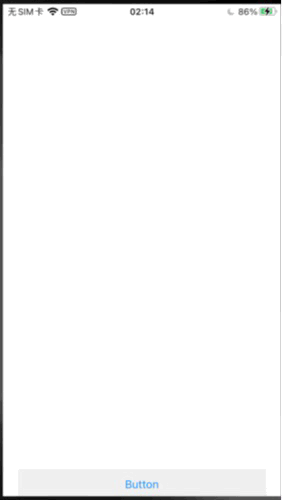

# XLLoger

> A float UI log viewer for device.

## Screenshots


## Installation
#### Cocoapods
```pod "XLLoger"```

## Usage
#### Init
```
#import <XLLoger/XLLogerManager.h>
// In -application:didFinishLaunchingWithOptions:
[[XLLogerManager manager] prepare];
```
### Show log UI
```
[[XLLogerManager manager] showOnWindow];
or
[[XLLogerManager manager] showOnView:superView];
```
